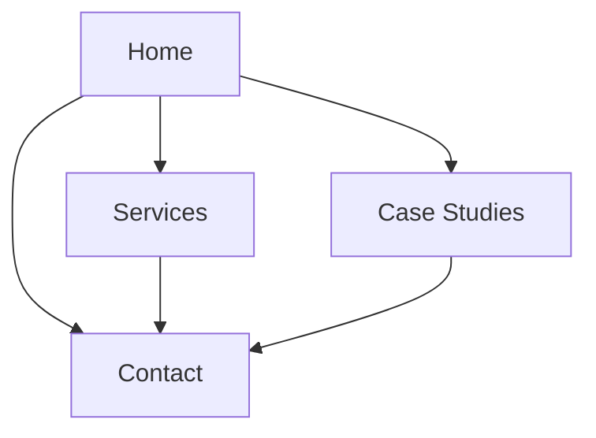

## 1. Product Overview
Convert your current single-page marketing site into a smooth, multi-page experience with a navbar like antimatterai.com.
Focus on noticeably better scroll/particle performance and a premium hero “wavy” split-word text animation.

## 2. Core Features

### 2.1 Feature Module
Our requirements consist of the following main pages:
1. **Home**: navbar, hero (wavy split-word animation), lightweight particle background, key sections preview, primary CTA.
2. **Services**: services overview, supporting proof points, CTA.
3. **Case Studies**: case studies list/grid, individual case study cards, CTA.
4. **Contact**: contact form, contact information, confirmation state.

### 2.2 Page Details
| Page Name | Module Name | Feature description |
|-----------|-------------|---------------------|
| Global | Multi-page navigation | Navigate via a persistent top navbar with active-state indication; keep layout consistent across pages. |
| Global | Performance: particles + scrolling | Reduce perceived lag by ensuring particle rendering does not block scrolling; maintain stable frame pacing during scroll and page transitions. |
| Global | Footer | Provide consistent footer with secondary links and brand info across all pages. |
| Home | Hero: split-word wavy animation | Render headline text split by word; animate words in a wave sequence on first load and on re-entry (as defined). |
| Home | Hero: particle background | Display particle/canvas background behind hero with safe defaults (reduced density on low-power devices). |
| Home | Sections preview | Present concise previews for Services and Case Studies with links to their dedicated pages. |
| Home | Primary CTA | Route users to Contact from hero and from bottom CTA block. |
| Services | Services content | Present service categories and short descriptions in a scannable layout. |
| Services | Proof points | Show key stats/trust indicators to support credibility. |
| Services | CTA block | Send users to Contact with a strong CTA. |
| Case Studies | Case studies list | Display case studies as cards with title, short summary, and logo/visual. |
| Case Studies | Navigation to contact | Offer CTA(s) to start a conversation (route to Contact). |
| Contact | Contact form | Collect name, email, company (optional), and message; validate required fields; show success and error states. |
| Contact | Confirmation | Show an on-page confirmation after submission (no page reload). |

## 3. Core Process
- Visitor arrives on **Home**, sees hero animation and primary CTA.
- Visitor uses the **navbar** to navigate to **Services** and/or **Case Studies**.
- Visitor clicks any CTA and lands on **Contact**, submits the form, and sees a confirmation message.

