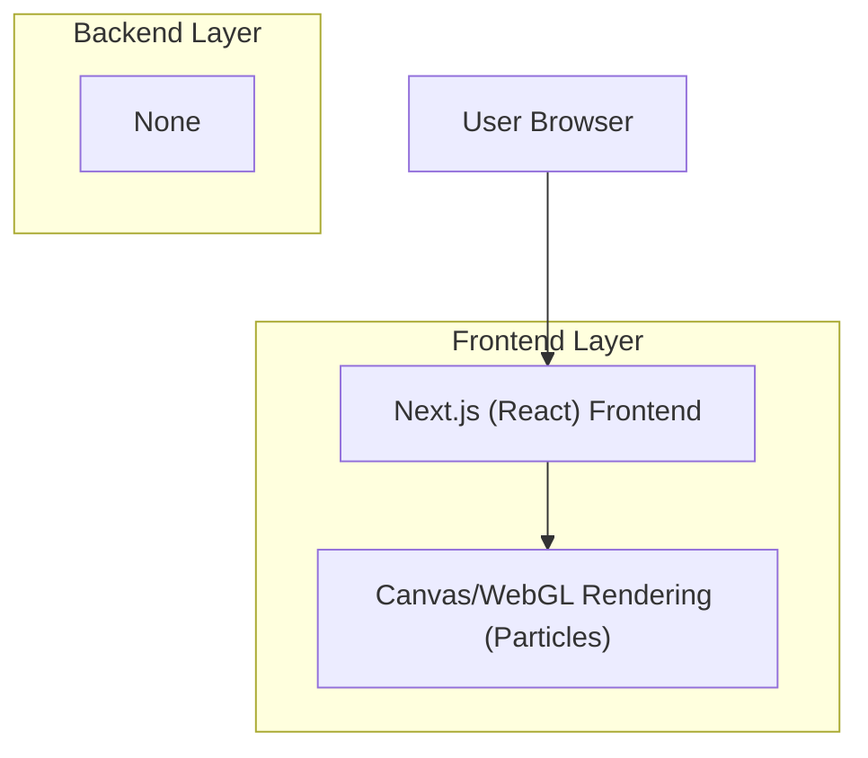

## 1.Architecture design

## 2.Technology Description
- Frontend: Next.js@16 (App Router) + React@19 + TypeScript@5
- Styling/UI: TailwindCSS@3 + shadcn/ui (Radix UI)
- 3D/Particles: three@0.170 + @react-three/fiber + @react-three/drei
- Animation (hero text): Prefer CSS keyframes for baseline; optionally add framer-motion (small bundle, React-first)
- Backend: None (static marketing pages + client-side contact submit target TBD)

## 3.Route definitions
| Route | Purpose |
|-------|---------|
| / | Home page: hero animation + performance-safe particles + previews |
| /services | Services page: services overview and CTA |
| /case-studies | Case studies page: cards/list and CTA |
| /contact | Contact page: form + confirmation state |

## 4.Performance architecture notes (implementation-level)
- Scroll handling: use passive listeners; avoid layout thrash (no per-scroll DOM reads/writes); prefer IntersectionObserver for section entry effects.
- Particle/3D rendering:
  - Decouple scroll from render loop: update “target” values on scroll, interpolate in RAF/useFrame.
  - Reduce work on low-power devices: cap particle count, reduce DPR (e.g., 1–1.5), pause when tab hidden, and disable when prefers-reduced-motion.
  - For React Three Fiber scenes: prefer controlled rendering (e.g., frameloop="demand" + invalidate) for mostly-static hero scenes.
- React performance: memoize heavy components; keep particle canvas isolated to avoid rerenders from page state.
- Next.js navigation: ensure each page is a route (not anchor scroll) to reduce long-page layout cost and improve perceived performance.

## 5.Data model(if applicable)
No database required.
